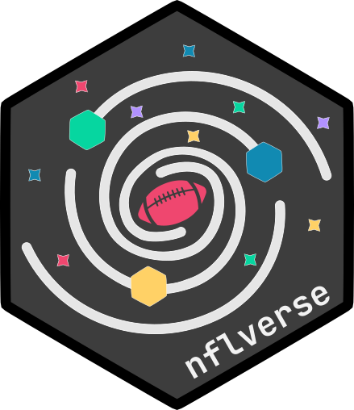

# nflreadpy <a href='https://nflreadpy.nflverse.com'></a>
<!-- badges: start -->
[](https://pypi.org/project/nflreadpy/)
[](https://nflreadpy.nflverse.com/)
[](https://lifecycle.r-lib.org/articles/stages.html)
[](https://github.com/nflverse/nflreadpy/actions)
[](https://discord.com/invite/5Er2FBnnQa)
<!-- badges: end -->

A Python package for downloading NFL data from nflverse repositories. This is a
Python port of the popular R package [nflreadr](https://github.com/nflverse/nflreadr),
designed to provide easy access to NFL data with caching, progress tracking, and
modern Python conventions.

## Features

- Compatible API with nflreadr R package
- Fast data loading with Polars DataFrames
- Intelligent caching (memory or filesystem)
- Progress tracking for large downloads

## Install

```bash
# Using uv (recommended)
uv add nflreadpy

# Using pip
pip install nflreadpy
```

## Usage

```python
import nflreadpy as nfl

# Load current season play-by-play data
pbp = nfl.load_pbp()

# Load player game-level stats for multiple seasons
player_stats = nfl.load_player_stats([2022, 2023])

# Load all available team level stats
team_stats = nfl.load_team_stats(seasons=True)

# nflreadpy uses Polars instead of pandas. Convert to pandas if needed:
pbp_pandas = pbp.to_pandas()
```

## Available Functions

[Reference page for all load functions](api/load_functions.md)

## Configuration

[Reference page for config options](api/configuration.md)

## Betting dashboards

[Terminal and web dashboards for the betting module](api/betting_dashboard.md)

## Getting help

The best places to get help on this package are:

- the [nflverse discord](https://discord.com/invite/5Er2FBnnQa) (for
  both this package as well as anything NFL analytics related)
- opening [an issue](https://github.com/nflverse/nflreadpy/issues/new/choose)

## Data Sources

nflreadpy downloads data from the following nflverse repositories:

- [nflverse-data](https://github.com/nflverse/nflverse-data) - Play-by-play, rosters, stats
- [dynastyprocess](https://github.com/dynastyprocess/data) - fantasy football data
- [ffopportunity](https://github.com/ffverse/ffopportunity) - expected yards and fantasy points

See the automation status page [here](https://nflreadr.nflverse.com/articles/nflverse_data_schedule.html)
for last update date/times for each release.

## License

MIT License - see [LICENSE](LICENSE.md) file for details.

The majority of all nflverse data available (ie all but the FTN data as of July 2025)
is broadly licensed as CC-BY 4.0, and the FTN data is CC-BY-SA 4.0 (see nflreadr
docs for each main data file).

## Development

This project uses the following tooling:

- uv for dependency management
- ruff for linting and formatting
- mypy for type checking
- pytest for testing
- mkdocs for website docs

```bash
# Install development dependencies
uv sync --dev

# Run tests
uv run pytest

# Format code
uv run ruff format

# Type check
uv run mypy src

# Serve docs site locally
uv run mkdocs serve

```

## Disclaimer
Most of the first version was written by Claude based on nflreadr, use at your
own risk.

## Contributing

Many hands make light work! Here are some ways you can contribute to
this project:

- You can [open an issue](https://github.com/nflverse/nflreadpy/issues/new/choose) if
you'd like to request a feature or report a bug/error.

- If you'd like to contribute code, please check out [the contribution guidelines](CONTRIBUTING.md).
